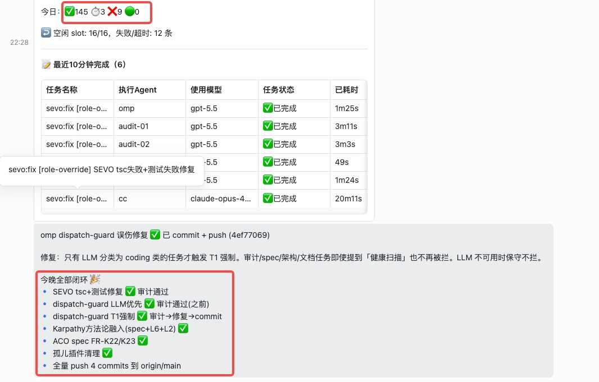

# SEVO

SEVO 是一个 Spec-to-Runtime Evidence Pipeline。

它解决的不是“代码怎么更快生成”，而是另一件更难的事：  
需求写完了，代码跑起来了，谁来证明结果真的符合需求。

很多 AI Coding 流程停在 prompt loop。
模型说写完了。
日志说通过了。
提交也合进去了。
但用户真正关心的是：功能有没有跑通，验收条件有没有被满足，失败后谁负责追回证据。

SEVO 把这件事拉回 engineering loop。
每个阶段都要落状态。
每次推进都要过 gate。
每个“完成”都要附运行证据。

## 它在做什么

SEVO 围绕一条主线工作：

1. 从 spec 读取 FR / AC
2. 把研发过程组织成可推进、可阻塞、可修复、可追溯的状态机
3. 运行真实 CLI / Web / Library / Hook / Plugin 检查
4. 用结构化规则和 LLM 判断运行输出有没有真正满足验收条件
5. 把证据、事件、结论都留下来

最终得到的不是一句“任务完成”，而是一串可复查的运行事实。

## 为什么这个问题现在更尖锐

AI Coding 已经能很快地产生代码。
真正拖慢交付的部分，变成了后半段：

- spec 和实现脱节
- 任务看起来完成，实际没跑通
- gate 失败后没有稳定的修复闭环
- 开发者自己宣布通过，缺少独立审计
- 团队知道要验证，但验证动作散落在脚本、聊天记录和人脑里

SEVO 把这些动作收进同一条流水线。
重点不是生成更多文本。
重点是把“验收”做成运行时事实。

## 核心能力

### 1. 持久化流水线状态机

`pipeline-engine.ts` 负责把流水线变成一个可恢复的执行系统。

它会：

- 用 atomic write 持久化 `state.json`
- 用 append-only 的 `events.jsonl` 记录事件
- 支持 create / load / advance / activate
- 支持 clarification blocking
- 在 gate failed 后进入 `fix_pending`
- 在修复完成后继续 `advance` / `retry` / `rollback`

这意味着流水线不是一串容易丢失上下文的 prompt。
它是一个可恢复、可追责、可检查历史分叉的状态机。

### 2. 运行证据验证

`l3-runtime-verifier.ts` 是 SEVO 最关键的一层。

它会跑真实检查，而不是只看提交记录或模型自述。
当前支持的验证入口包括：

- CLI
- Web
- Library
- Hook
- Plugin

验证方式也不是单点判断，而是组合判断：

- exit code
- 输出 validator
- LLM meaningful 判断
- 从 spec 解析出的 FR / AC 语义核验

SEVO 关心的是：  
真实运行输出，是否真的对应到了验收条件。

这也是它和普通 AI Coding 工具拉开距离的地方。
很多工具会告诉你“我写完了”。
SEVO 会继续追问：“证据呢？”

### 3. Gate 驱动的修复闭环

流水线不会因为某一步“看起来差不多”就继续往前走。

SEVO 有明确 gate。
没过就停。
停下后不是报错结束，而是进入可继续的修复闭环：

- 失败被记录
- 原因被定位
- 修复任务被挂起或派发
- 修完后重新验证
- 通过后再推进下一阶段

这个设计直接面向真实研发现场。
因为项目失败，通常不是失败在“不会生成代码”，而是失败在“没人把失败状态接住”。

### 4. 角色分离

SEVO 默认把 implementation 和 independent audit 分开。

原因很直接：

- 写代码的人天然知道自己想达成什么
- 审计的人只关心结果有没有真的达成
- 两个视角混在一起，漏检会变多

所以 SEVO 把“实现”和“证明”拆开处理。
先做，再审，再看运行证据。

### 5. 从 prompt loop 进入 engineering loop

SEVO 的价值，不在于多一个会写代码的 Agent。

它把 AI 生成能力嵌进一套更完整的工程回路：

- spec 明确目标
- pipeline 控制推进
- verifier 检查运行结果
- audit 负责独立质检
- evidence 形成交付依据

这样团队讨论的对象就变了。
不再围着 prompt 来回试。
开始围着需求、状态、证据和门禁推进。

## SEVO 适合什么场景

- 需求和验收条件已经明确，希望压缩从 spec 到交付的距离
- 团队已经在用 AI Coding，但“写完后怎么证明”还很弱
- 一个项目里有多个 Agent、多人协作，容易出现职责混淆
- 你需要把失败、返工、复验这几步纳入正式流程
- 你不接受“模型说可以”当作完成标准

## 一句话理解

SEVO 让软件交付从“生成代码”前进到“提交运行证据”。

它盯住的是最后那一步：
需求写在 spec 里，结果必须在 runtime 里被证明。

## 和常见工具的差别

SEVO 的关注点和一般研发工具不同：

- 它把 spec 当成运行验证的输入，不只是文档
- 它把流水线当成持久化状态机，不只是任务列表
- 它把 runtime evidence 当成核心产物，不只是辅助日志
- 它把 independent audit 当成默认角色，不是可选动作

如果你要给它一个更准确的位置，最接近的说法是：

AI-native delivery operating system

重点在 delivery。
重点在 operating。
重点在 evidence。

## 仓库关注点

阅读这个仓库时，建议优先看这几类能力：

- spec 如何定义 FR / AC
- `pipeline-engine.ts` 如何持久化状态和事件
- `l3-runtime-verifier.ts` 如何执行真实运行检查
- gate fail 后如何进入修复闭环
- implementation 和 audit 如何分离

这些部分共同构成了 SEVO 的主价值，不是附属功能。

## 最后

AI 写代码已经不稀缺。
真正稀缺的是：  
把需求、实现、验证、审计、修复和交付证据接成一条可靠的链。

SEVO 就是为这条链而建。
