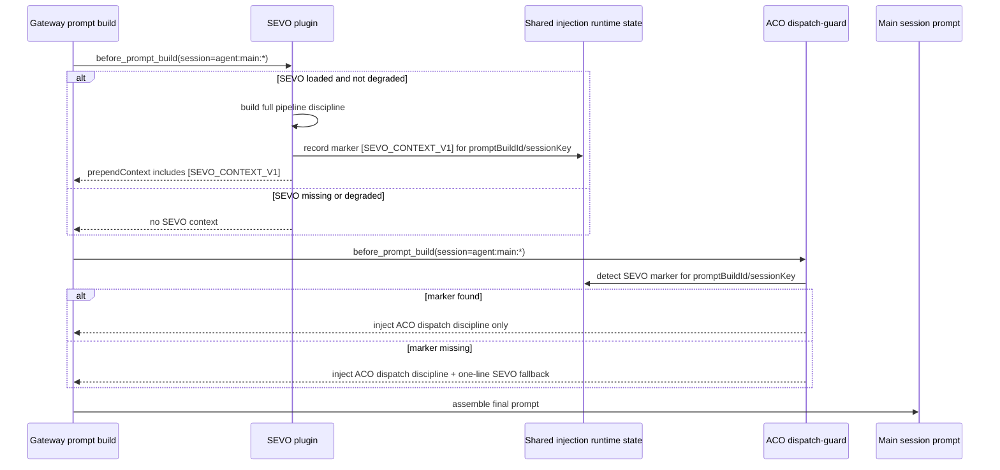
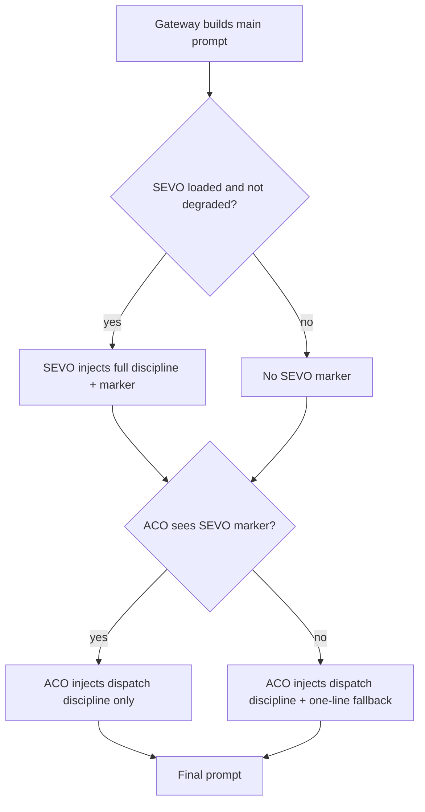

# 注入所有权迁移架构设计

OpenClaw（sa-01 子Agent）｜2026-06-07

## 结论

采用 Plan C：SEVO 插件持有并注入完整流水线纪律，ACO dispatch-guard 只保留调度通用纪律和一句 fallback。正常路径下，主会话只看到 SEVO 的完整纪律；SEVO 未注入、降级或缺失时，ACO 注入一句兜底提醒，避免研发任务完全失去流水线引导。

本方案的关键接口是一个稳定 marker：`[SEVO_CONTEXT_V1]`。SEVO 每轮主会话 prompt 构建成功注入时写入该 marker，并同步写入共享运行态；ACO 只检测 marker 是否存在，不检查 Spec-First、入口检查、审计闭环等完整纪律内容。完整性审计只属于 SEVO。

## 范围

本设计覆盖两个组件：

- SEVO 插件：`projects/sevo/index.js`，负责 `before_prompt_build` 阶段的完整流水线纪律注入。
- ACO dispatch-guard：`extensions/aco-dispatch-guard/index.js`，负责调度通用纪律注入，并在 SEVO 提示缺失时注入一句 fallback。

本设计不修改 spec、不修改代码、不修改 `openclaw.json`。

## 需求依据

### SEVO FR-14a

SEVO spec 已定义：

- 每次主会话 prompt 构建时无条件注入流水线纪律。
- 注入不依赖 tracked project、受管项目列表、projectSlug 或 active pipeline。
- 注入内容覆盖四类规则：Spec-First、`sevo:` 入口检查、开发完成后独立审计与修复复验闭环、主 Agent 与 SEVO 引导式握手。
- ACO 只保留 fallback，不维护完整文本。

### ACO fallback 边界

ACO spec 已定义：

- ACO L2 插件职责是路由和引导，不重复维护 SEVO 完整流水线纪律。
- ACO 只保留一句 fallback，例如“遵循 SEVO 流水线引导”。
- 当 SEVO 插件正常加载并已注入流水线纪律时，ACO 不重复注入 Spec-First、入口检查、开发完成后审计、review → fix loop 等完整文本。

### 当前实现风险

当前 SEVO 的 `buildSevoContextQuickReference()` 位于 `tracked.length > 0` 守卫内。若直接把完整纪律迁入该函数但不调整调用条件，在无 tracked project、tracked 加载失败、初始化前场景下，SEVO 纪律会消失。ACO 如果同时删除旧规则，会导致主会话失去 Spec-First 和审计闭环提醒。

## 设计目标

1. SEVO 是流水线纪律唯一权威来源。
2. ACO 不重复注入完整 SEVO 纪律，不解析完整纪律内容。
3. 无 tracked project 时，SEVO 仍然注入完整纪律。
4. SEVO 缺失、降级或本轮注入失败时，ACO 通过一句 fallback 兜底。
5. 两个插件之间有可观测、稳定、可测试的接口契约。
6. 开发 Agent 能按本文直接实现，不需要再判断“怎么确认 SEVO 是否已注入”。

## 组件职责

### SEVO 插件

SEVO 负责：

- 在主会话 `before_prompt_build` 每轮注入完整流水线纪律。
- 注入文本包含稳定 marker `[SEVO_CONTEXT_V1]`。
- 注入文本按四类规则组织，每类包含目标、做什么、Why。
- tracked project 只作为路径提示追加，不作为是否注入纪律的前置条件。
- 写入本轮注入状态，供 ACO fallback 判断。
- 写入审计事件，记录本轮注入是否成功。

SEVO 不负责：

- Agent 角色选择、timeout、并发、看板自查、禁止 poll 等调度通用纪律。
- 判断 ACO 是否应该注入 fallback。

### ACO dispatch-guard

ACO 负责：

- 保留调度通用纪律注入：看板自查、agent 选择验证、timeout、禁止 poll、并发、失败重派、主会话空闲、prompt 质量等。
- 检测本轮是否已有 SEVO marker。
- SEVO marker 缺失时，注入一句 fallback。
- 写入审计事件，记录 fallback 是否触发、触发原因、检测来源。

ACO 不负责：

- 维护 Spec-First、`sevo:` 入口检查、开发完成后审计、review → fix loop、握手规则的完整文本。
- 判断 SEVO 完整纪律是否内容齐全。
- 基于关键词或正则判断研发活动语义。fallback 检测只看稳定 marker 和共享状态，不做语义分类。

## 组件交互图





## 接口契约

### 契约 1：SEVO 注入 marker

SEVO 完整纪律注入文本必须包含独立、稳定、大小写敏感的 marker：

```text
[SEVO_CONTEXT_V1]
```

marker 要求：

- 必须出现在 SEVO 完整纪律段的第一屏内，建议紧跟标题之后。
- 不能放在注释、审计日志或仅代码内部；必须进入主会话可见 prompt。
- 版本号只在契约语义变化时升级。文案修改、措辞优化、增删细节不升级。
- ACO 只能检测该 marker，不检测完整规则正文。

推荐 SEVO 注入段结构：

```text
## ℹ️ SEVO 流水线纪律提醒
[SEVO_CONTEXT_V1]

目标：让一切研发活动进入可追溯、可审计、可复验的流水线。
做什么：派发前先确认 spec FR/AC 覆盖；需要研发推进时使用 sevo:create / sevo:implement / sevo:fix / sevo:from；开发完成后进入独立审计并处理修复复验；接受 SEVO 的引导式路由提示。
Why：缺少这条链路会让需求、实现、审计和交付证据断开，用户追问时无法证明结果真实完成。

- Spec-First：...
- SEVO 入口：...
- 开发→审计→复验：...
- 引导式握手：...
- 路径提示：...
```

### 契约 2：共享运行态

只靠最终 prompt 文本检测不一定可靠，因为插件之间未必能读取已拼接的 `prependContext`。因此 SEVO 还要写入共享运行态，ACO 优先读取共享运行态。

推荐共享状态键：

```js
globalThis[Symbol.for('openclaw.sevo.promptInjectionState')]
```

推荐结构：

```js
{
  version: 1,
  marker: '[SEVO_CONTEXT_V1]',
  promptBuilds: Map<string, {
    sessionKey: string,
    marker: '[SEVO_CONTEXT_V1]',
    injectedAt: string,
    degraded: false,
    source: 'sevo.before_prompt_build',
    textHash: string
  }>,
  lastBySession: Map<string, {
    marker: '[SEVO_CONTEXT_V1]',
    injectedAt: string,
    promptBuildId: string,
    degraded: false,
    source: 'sevo.before_prompt_build'
  }>
}
```

`promptBuildId` 获取规则：

1. 如果 Gateway event/context 提供稳定 request id、turn id、prompt build id，使用该值。
2. 若没有，使用 `${sessionKey}:${Date.now()}` 生成本轮 id，同时写入 `lastBySession`。
3. ACO 检测时先查同一 `promptBuildId`，没有则查 `lastBySession[sessionKey]`，但 `injectedAt` 距当前时间超过 30 秒视为过期。

### 契约 3：ACO 检测顺序

ACO 判断 SEVO 是否已注入时，按以下顺序：

1. 读取 `globalThis[Symbol.for('openclaw.sevo.promptInjectionState')]`。
2. 若存在同一 `promptBuildId` 且 marker 为 `[SEVO_CONTEXT_V1]`，判定 SEVO 已注入。
3. 若没有 `promptBuildId`，读取 `lastBySession[sessionKey]`，且 `injectedAt` 距当前时间不超过 30 秒，判定 SEVO 已注入。
4. 若 event/context 暴露已拼接上下文，再扫描文本中是否存在 `[SEVO_CONTEXT_V1]`。
5. 以上都失败，判定 SEVO 未确认注入，触发 fallback。

ACO 不读取 SEVO tracked project 列表，不调用 SEVO 内部函数，不解析 SEVO 注入正文。

### 契约 4：审计事件

SEVO 注入成功时写入事件：

```json
{
  "type": "sevo_prompt_discipline_injected",
  "sessionKey": "agent:main:...",
  "promptBuildId": "...",
  "marker": "[SEVO_CONTEXT_V1]",
  "trackedProjectCount": 0,
  "degraded": false,
  "textHash": "sha256:..."
}
```

ACO fallback 检测结果写入事件：

```json
{
  "type": "aco_sevo_fallback_decision",
  "sessionKey": "agent:main:...",
  "promptBuildId": "...",
  "sevoMarkerFound": true,
  "detectionSource": "shared_state|prompt_text|missing|expired",
  "fallbackInjected": false,
  "marker": "[SEVO_CONTEXT_V1]"
}
```

当 fallback 触发：

```json
{
  "type": "aco_sevo_fallback_decision",
  "sessionKey": "agent:main:...",
  "promptBuildId": "...",
  "sevoMarkerFound": false,
  "detectionSource": "missing",
  "fallbackInjected": true,
  "fallbackText": "研发类变更请遵循 SEVO 流水线引导。"
}
```

## 稳定标记设计

### Marker 文本

固定使用：

```text
[SEVO_CONTEXT_V1]
```

选择原因：

- 不依赖中文文案，后续可以改写注入文本。
- 不依赖函数名或文件路径，代码迁移后仍稳定。
- 版本号可支持未来契约升级。
- ACO 检测简单，不引入语义判断。

### Marker 生命周期

- SEVO 每轮主会话 prompt 构建成功注入时写入 marker。
- marker 只表示“SEVO 本轮已注入完整纪律段”，不表示当前任务已在流水线内，不表示 spec 已覆盖，不表示审计已通过。
- ACO 只使用 marker 决定是否追加 fallback。

### 去重规则

- 最终 prompt 中 `[SEVO_CONTEXT_V1]` 出现 1 次为正常。
- 出现 0 次且 ACO fallback 出现 1 次为降级正常。
- 出现 2 次或更多表示 SEVO 重复注入，需要修复 SEVO 内部去重。
- 出现 1 次 marker 同时出现 ACO 完整 SEVO 纪律文本，表示 ACO 边界回退，需要修复 ACO。

## SEVO 注入策略

SEVO 的 `before_prompt_build` 主 hook 应拆成两层：

1. 永久纪律层：无条件注入，只要求 session 是主会话且 SEVO 未 degraded。
2. 路径提示层：有 tracked project 时追加 tracked path hints；没有时显示“暂无路径提示”。

伪代码：

```js
if (sevoGlobal.degraded) return null;
if (!sessionKey.startsWith('agent:main:')) return null;

const parts = [];

const tracked = safeLoadTrackedProjects();
const trackedPaths = tracked.length > 0 ? getTrackedPathHints(tracked) : [];
parts.push(buildSevoContextQuickReference(trackedPaths, tracked.map(p => p.slug)));
recordSevoPromptInjection({ sessionKey, promptBuildId, marker: '[SEVO_CONTEXT_V1]' });

// existing reminders and progress notices continue below
```

`buildSevoContextQuickReference()` 应输出完整 FR-14a 四类规则，并包含 marker。tracked project 只影响路径提示，不影响函数调用。

## ACO fallback 策略

ACO 的 `before_prompt_build` 返回内容分为两段：

1. ACO 调度通用纪律：始终注入。
2. SEVO fallback：仅在主会话且 SEVO marker 未确认时注入。

推荐 fallback 文本：

```text
⚠️ SEVO fallback：研发类变更请遵循 SEVO 流水线引导。
Why：如果 SEVO 本轮提示缺失，这句兜底能提醒主会话不要把研发动作当普通裸任务处理。
```

fallback 约束：

- 只能是一句主提醒 + 一句 Why，不展开 Spec-First、入口检查、审计闭环、review-fix loop。
- 不出现完整纪律清单。
- 不阻断 spawn。
- 不影响非主会话。
- 不使用关键词或正则做研发语义判断；fallback 是 prompt 层可见提醒，不是分类决策。

ACO 检测伪代码：

```js
const isMainSession = sessionKey.startsWith('agent:main:') || sessionAgentId === 'main';
const sevoInjection = detectSevoInjection({ sessionKey, promptBuildId, event, ctx });
const sevoFallback = isMainSession && !sevoInjection.found
  ? '\n\n⚠️ SEVO fallback：研发类变更请遵循 SEVO 流水线引导。\nWhy：如果 SEVO 本轮提示缺失，这句兜底能提醒主会话不要把研发动作当普通裸任务处理。'
  : '';

appendAuditEvent({
  type: 'aco_sevo_fallback_decision',
  sessionKey,
  promptBuildId,
  sevoMarkerFound: sevoInjection.found,
  detectionSource: sevoInjection.source,
  fallbackInjected: Boolean(sevoFallback),
  marker: '[SEVO_CONTEXT_V1]'
});

return { prependContext: DISPATCH_GUARD_PROMPT + acoOnlyRules + sevoFallback };
```

## 降级路径

### 场景 1：SEVO 插件正常加载

- SEVO 注入完整纪律 + marker。
- ACO 检测 marker 存在。
- ACO 不注入 fallback。
- 最终 prompt：SEVO 完整纪律 + ACO 调度纪律。

### 场景 2：SEVO 无 tracked project

- SEVO 仍注入完整纪律 + marker。
- 路径提示显示“暂无路径提示”。
- ACO 检测 marker 存在。
- ACO 不注入 fallback。

### 场景 3：SEVO degraded

- SEVO 不注入 marker。
- ACO 检测 marker 缺失。
- ACO 注入一句 fallback。
- 最终 prompt：ACO 调度纪律 + 一句 SEVO fallback。

### 场景 4：SEVO 插件未加载

- 共享状态不存在。
- ACO 检测 marker 缺失。
- ACO 注入一句 fallback。
- 最终 prompt：ACO 调度纪律 + 一句 SEVO fallback。

### 场景 5：共享状态写入失败，但 prompt 文本可见

- ACO 尝试从 event/context 已拼接上下文查找 marker。
- 找到 marker，不注入 fallback。
- 写审计事件 `detectionSource="prompt_text"`。

### 场景 6：共享状态与 prompt 文本都不可见

- ACO 判定 SEVO 未确认注入。
- 注入一句 fallback。
- 这是安全降级：允许出现短提醒重复，也不能出现完整纪律重复。

## 回滚方案

### 快速回滚

如果迁移后出现主会话丢失 SEVO 纪律、ACO fallback 不触发或 prompt 构建异常：

1. 保留 SEVO 新注入不动。
2. 在 ACO 中临时恢复旧的完整 SEVO 纪律注入段。
3. 禁用 ACO marker 检测分支或让检测结果始终走 fallback。
4. 重新跑只读 doctor，确认 Errors 为 0。
5. 观察主会话 prompt 是否恢复完整纪律。

快速回滚的代价是 token 重复，但能恢复行为可靠性。

### 精准回滚

如果只有 marker 检测有问题：

- SEVO 继续注入完整纪律。
- ACO fallback 改为每轮主会话都注入一句短 fallback。
- 不恢复 ACO 完整纪律。

该方案适用于共享状态或 promptBuildId 契约不稳定，但 SEVO 注入本身正常的情况。

### 完全回滚

如果 SEVO 新注入导致 prompt 构建失败：

- 回退 SEVO `buildSevoContextQuickReference()` 和 `before_prompt_build` 调用逻辑到迁移前版本。
- ACO 保留旧完整纪律注入。
- 保留审计报告，后续重新设计。

完全回滚只作为最后手段，因为它会恢复职责混乱。

## 测试与验收

### 单元测试

SEVO：

1. `buildSevoContextQuickReference([], [])` 输出包含 `[SEVO_CONTEXT_V1]`。
2. 输出包含四类规则：Spec-First、`sevo:` 入口、开发→审计→复验、引导式握手。
3. 每类规则包含目标、做什么、Why。
4. trackedPaths 为空时仍输出完整纪律。

ACO：

1. 共享状态有同轮 marker 时，不注入 fallback。
2. 共享状态无 marker 时，注入一句 fallback。
3. marker 过期时，注入一句 fallback。
4. 非主会话不注入 fallback。
5. fallback 文本不包含完整纪律关键词段落，不出现 Spec-First 展开、review-fix loop 展开、独立审计展开。

### 集成测试

1. 有 tracked project：最终 prompt 包含 `[SEVO_CONTEXT_V1]`，不包含 ACO 完整 SEVO 纪律。
2. 无 tracked project：最终 prompt 仍包含 `[SEVO_CONTEXT_V1]`。
3. 模拟 SEVO degraded：最终 prompt 不包含 marker，包含一句 ACO fallback。
4. 模拟 SEVO 未加载：最终 prompt 包含一句 ACO fallback。
5. 连续两轮主会话 prompt：每轮最多一个 SEVO marker，ACO fallback 决策事件各一条。

### 审计验收

开发完成后，审计者不需要读源码即可从以下证据判断是否通过：

- prompt 片段：SEVO marker 与注入文本。
- ACO prompt 片段：只有一句 fallback 或无 fallback。
- `sevo_prompt_discipline_injected` 审计事件。
- `aco_sevo_fallback_decision` 审计事件。
- 无 tracked project 环境下的注入结果。
- SEVO degraded 环境下的 fallback 结果。

## 实施顺序建议

1. SEVO：先实现无条件主会话永久注入 + marker + 共享运行态 + 审计事件。
2. SEVO：把 tracked project 守卫降级为路径提示，不再控制纪律注入。
3. ACO：删除或压缩完整 SEVO 纪律文本，只保留 ACO 调度通用纪律。
4. ACO：实现 marker 检测和一句 fallback。
5. 测试：先测 SEVO 单独注入，再测 ACO fallback，再测两个插件同时加载。
6. 审计：重点看重复注入和降级路径。

## 开发注意事项

- 不要让 ACO 调用 SEVO 的内部函数。跨组件接口只用 marker、共享运行态和审计事件。
- 不要让 ACO 检查 SEVO 文案是否包含四类完整纪律。该检查属于 SEVO 自己的测试和审计。
- 不要用 tracked project 是否存在判断是否注入 SEVO 纪律。
- 不要依赖 hook priority 解决重复注入。priority 只能影响顺序，不能保证去重。
- 不要把 fallback 写成长规则。fallback 是缺失提醒，不是第二份 SEVO 规则。
- 不要使用对抗性措辞。注入文本使用引导、准入校验、路由、握手等表达。

## 最终状态

迁移完成后，提示注入职责如下：

- SEVO：完整流水线纪律，唯一权威来源。
- ACO：调度通用纪律，外加 SEVO 缺失时的一句 fallback。
- Gateway：按 hook 生命周期聚合上下文，不承担跨插件去重。
- 主会话：看到 SEVO 完整纪律后按流水线推进；SEVO 缺失时至少看到 ACO fallback。
