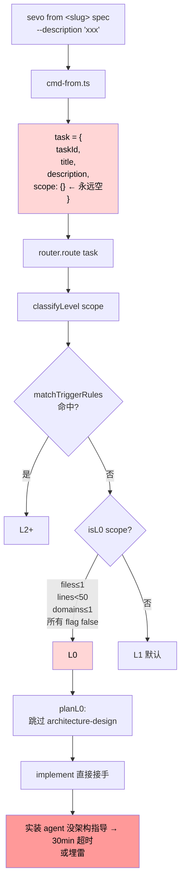

# Router Level Classifier 误判修复 — 架构设计

OpenClaw（sa-02 子Agent）/ 2026-05-24

## 1. 问题陈述与系统自身缺陷边界

### 1.1 当前 L0 判定的输入与盲点

`src/router/level-classifier.ts` 的 `classifyLevel` 接受的唯一信号是
`TaskScope` 元数据：`estimatedFiles`、`estimatedLines`、`affectedDomains`、
`isNewModule`、`hasDataModelChange`、`hasGovernanceChange`、`hasReleaseTargetChange`、
`userExplicitFullPipeline`。

判定顺序：

1. 任一 L2 触发规则命中 → `L2+`
2. 否则若 `isL0(scope)` 为真 → `L0`
3. 否则 → `L1`（保守默认）

`isL0` 在四类条件同时满足时返回真：

- `estimatedFiles ?? 1 ≤ L0_THRESHOLDS.maxFiles`（默认 1）
- `estimatedLines ?? 0 < L0_THRESHOLDS.maxLines`（默认 50）
- `affectedDomains.length ≤ 1`
- 五个布尔标志全 false（含 `isNewModule`、`hasDataModelChange` 等）

盲点在于：默认值与"语义空"不可区分。`scope = {}` 与"用户确认这是单文件 typo"
走相同的代码路径——前者 `estimatedFiles ?? 1` 取 1，`estimatedLines ?? 0` 取 0，
所有布尔标志默认 false，于是空 scope 必落 L0。

CLI 入口 `src/cli/cmd-from.ts` 第 38 行的实参就是 `scope: {}`：

```typescript
const task: PipelineTask = {
  taskId: `from-${slug}-${stage}-${Date.now()}`,
  title: opts.title,
  description: opts.description,
  scope: {},
};
```

`description` 字段被收下后只透传到 task.description，从未参与路由判定。
路由判定收到的 scope 永远是空对象，于是无论 description 写什么——"实装 FR-P03
新增 metadata-extractor service"或"修个错别字"——都被路由判 L0。

L0 通过 `L0_REQUIRED_STAGES`（`src/constants.ts`）只保留
`implement / review / regression / verify / ledger`，`architecture-design` 在
`L0_SKIP_REASONS` 里被显式标记跳过。FR 实装类任务因此绕过架构详设直接进
implement。

### 1.2 「FR 实装」与「真 L0 微小改动」的边界差异

真 L0 的特征：原子改动、无新组件、无新数据流、无外部契约扰动、人工审 1
分钟可定调。改坏了 `git revert` 即可。

FR 实装的特征：新增功能 / 新组件 / 新链路 / 新依赖关系 / 跨文件协作。
缺架构详设进 implement，编码 agent 只能凭印象自己拼模块边界，结果有四种：
不收敛超时、收敛但与既有架构冲突、漏关键非功能项（超时保护、错误传播、重试），
或勉强跑通但埋下耦合雷。

实证 badcase（2026-05-24）：4 路 KIVO P 域 FR 实装 + arc42 架构补丁，
TaskScope 全空 → 全部判 L0 → 跳 architect → 2 路 ACP agent 30min 超时 0
输出，1 路接力者勉强完成但暴露 LLM 超时保护漏写、走老路径的副作用。

边界差异本质：L0 假设 implementer 对架构有共识；FR 实装的前提就是架构尚未
形成共识。当前判定把"信号缺失"当作"信号为零"是这一类误判的根因。

## 2. 修复方向的设计取舍

### 2.1 方向一：CLI 入口强默认 L1

**做法**：CLI 构造 `PipelineTask` 时，若 `scope` 没有任一字段被显式设值，
不再走分类器，直接标记 `level = 'L1'`，理由记录为 "scope 元数据缺失，按保守
默认升级"。等价做法是在 `classifyLevel` 入口加 `isScopeEmpty(scope)` 守卫，
为空时直接返回 L1。

**权衡**：

- 优点：单点改动、零外部依赖、行为可预测、回归用例最容易写。彻底堵住"空 scope
  落 L0"这条路径。
- 缺点：放过了"真 L0 但用户没填 scope"的情况——典型如修一个 typo，用户没
  心思填字段，会被强制走 L1 全链路。架构 / UX / smoke / verify 都跑一遍，
  时间成本从 5 分钟变成 30+ 分钟。
- 缓解：与方向二、方向三组合，让"想真 L0 跑"有显式声明出口（`--level L0`
  或 description 启发式确认）。

### 2.2 方向二：从 description 推断 scope（启发式 + LLM）

**做法**：在 `classifyLevel` 之前插入 `inferScopeFromDescription(description)`
环节。两段实现：

1. 启发式快速拒绝。description 含「实装」「实现」「新增」「添加 X service」
   「新模块」「新增 compiler」「添加 X 链路」「接入 X」时，把 `isNewModule`
   置 true。命中即覆盖空 scope，路由直接 L2+。
2. 启发式未命中时调用 LLM（复用 `design-need-classifier.ts` 的 LLM 通道），
   让 LLM 输出结构化 `Partial<TaskScope>`：是否新增模块、估算文件数、估算行数、
   涉及域、是否动数据模型。LLM 不可用时退回方向一的强默认 L1。

**权衡**：

- 优点：把语义信号补回来，区分"修 typo"和"实装 FR"。description 就是用户
  唯一会写的语义入口，吃这条数据是最直接的修复。
- 缺点：启发式词表会漏召回（"补一下 metadata-extractor 的入口"未必命中关键词），
  LLM 调用引入 1-3s 延迟与额外失败模式。LLM 返回噪声时若不做兜底会反向误升级。
- 缓解：启发式与 LLM 串联（启发式优先），任何一层超时 / 解析失败都退回
  方向一的强默认 L1，永远偏保守。LLM prompt 强约束输出 schema，解析失败按
  fallback 处理。

### 2.3 方向三：CLI 加 `--level` 显式入参

**做法**：`sevo from <slug> spec --level L0|L1|L2+` 允许用户显式指定。
显式指定时跳过所有自动判定逻辑，按用户给定层级走流水线。未指定时仍走自动
路由（含方向一、二的修复）。

**权衡**：

- 优点：把"我知道这是 typo"这条出口暴露给用户，对方向一带来的"误升 L1"
  做精准对冲。零额外推理成本。
- 缺点：要求用户对 L0/L1/L2+ 有认知，新用户不会用。单独使用解决不了"用户
  不显式指定"这条主路径上的误判。
- 缓解：作为方向一、二的补充开关，不当主路径。文档与 `sevo from --help`
  里把判定规则写清楚。

### 2.4 方向四：architecture-design 强制阶段

**做法**：从 `L0_REQUIRED_STAGES` 里把 `architecture-design` 显式纳入；
或者在 `planL0()` 里强制保留 `architecture-design`，无论层级一律必经
架构详设。

**权衡**：

- 优点：彻底消除"FR 实装跳架构"这类风险，代价覆盖一切。
- 缺点：违反 L0 的核心定位（微小原子改动快速过路）。一行 typo 也跑 architect
  会把 SEVO 退化成"重型审批流水线"，与 L0 存在的初衷直接冲突。已沉淀的
  L0 fixture / 测试也会大面积破。
- 缓解：仅作"保险开关"在项目配置里提供，例如 `projectConfig.forceArchDesign
  = true`，让仍在早期 / 高风险阶段的项目主动开启；不作为默认行为。这条路
  与方向二的 `design-need-classifier` 已有的 LLM 判定有冗余，能合并到那里
  的不要再开新分支。

## 3. 推荐组合方案

**采用方向一 + 方向二 + 方向三，其中方向一为兜底，方向二为主判，方向三为
显式越权出口。方向四作为项目级配置项保留，默认关闭，不进默认路径。**

### 3.1 主路径

```
CLI 入口
  ├─ 用户显式 --level → 直接采用（方向三）
  └─ 自动判定
       ├─ scope 已含至少一个字段 → 走原 classifyLevel 不变
       └─ scope 为空
            ├─ description 命中启发式词表 → 补 isNewModule=true → 走原分类器
            ├─ 启发式未命中 → 调 LLM 推断 Partial<TaskScope> → 走原分类器
            └─ LLM 不可用 / 失败 / 解析异常 → 强默认 L1（方向一兜底）
```

### 3.2 评估「architecture-design 全程不可跳过」的可行性

不推荐设为默认。

理由：L0 的存在前提就是"原子改动跳重型阶段"，强制 architect 等于让 L0 退
化。真正风险点不在"L0 跳 architect"，而在"FR 实装被错判 L0"。前者堵住源头
（方向一 + 二）即可解决，后者属于"用大棒砸蚊子"。

但作为项目可选配置保留：在 `ProjectConfig` 里加 `forceArchDesignAllLevels:
boolean`，默认 false。早期 / 高风险项目可以主动打开，强制全级别经过 architect。
这把开关交给项目方，不绑死所有用户。

## 4. 判定边界规范

### 4.1 真 L0（自动可降级）

满足以下全部条件方可判 L0：

- 单文件改动（`estimatedFiles ≤ 1`）
- 改动行数 < 50
- 单域影响（`affectedDomains.length ≤ 1`）
- 无新增组件 / 模块 / service / API / DB schema / LLM 链路
- 无数据模型 / 治理 / 发布目标变更
- description 不含「实装 / 实现 / 新增 / 新模块 / 新增 service / 新增
  compiler / 接入」等关键词
- LLM 推断（若可用）`isNewModule = false` 且语义判定为微小改动

典型场景：单行 typo 修复、注释补充、变量重命名、测试 fixture 数据更新、
日志文案微调。

### 4.2 必须升 L1+

任一条件命中即升级到 L1（满足 L2+ 条件再升 L2+）：

- 新增组件 / 新模块 / 新 service / 新 API endpoint / 新 DB schema / 新
  LLM 链路 / 新外部依赖
- 跨文件改动且涉及调用关系变更
- 任何「实装 FR-Pxx」类任务（FR 实装语义在 description 中可识别）
- 跨域影响（≥ 2 个 domain）
- 触发任一 L2 trigger rule（`new-module / cross-domain / large-change /
  data-model-change / governance-change / release-target-change /
  user-explicit`）→ 升 L2+

### 4.3 边缘案例：单文件大改（如 100 行重构）

判定为 **L1**，理由：

- 行数已超过 L0_THRESHOLDS.maxLines（50）
- 100 行重构通常意味着结构调整、抽象拆分或行为变更，而非原子改动
- 单文件不等于无架构影响：内部模块边界、导出 API、错误传播路径都可能动
- 风险与收益比：跑一遍 architect + review + smoke，时间成本可控；漏跑
  一旦埋雷成本远高于此

例外：单文件 100 行的内容是"删除已废弃代码 + 注释更新"，且确认无外部
调用方，可由用户显式 `--level L0` 显式越权。

## 5. 数据流与判定流程图

### 5.1 现状 routing 流（暴露 description 不被消费的盲点）



红色节点暴露盲点链：description 写了但不进 scope；scope 空必落 L0；L0
跳 architect；FR 实装 agent 失去架构指导。

### 5.2 修复后 routing 流（显式越权 + 启发式 + LLM 推断 + 强默认）

```mermaid
flowchart TD
    A["sevo from &lt;slug&gt; spec<br/>--description 'xxx'<br/>--level &lt;L0|L1|L2+&gt;?"] --> B[cmd-from.ts]
    B --> C{用户显式<br/>--level?}
    C -- 是 --> D[直接采用<br/>用户层级]
    C -- 否 --> E[task.scope = {}<br/>+ description]
    E --> F[inferScopeFromDescription]
    F --> G{启发式词表<br/>命中?}
    G -- 命中 --> H["补 isNewModule=true<br/>or 估算字段"]
    G -- 未命中 --> I{LLM<br/>可用?}
    I -- 是 --> J["LLM 推断<br/>Partial&lt;TaskScope&gt;"]
    I -- 否 --> K[强默认 L1<br/>兜底]
    H --> L[classifyLevel<br/>原逻辑]
    J --> M{LLM 解析<br/>成功?}
    M -- 是 --> L
    M -- 否 --> K
    L --> N{level?}
    N -- L0 --> O[planL0<br/>跳 architect]
    N -- L1/L2+ --> P[planFullPipeline<br/>含 architect]
    K --> P
    D --> N
    
    style D fill:#d6f5d6,color:#000
    style H fill:#d6f5d6,color:#000
    style J fill:#d6f5d6,color:#000
    style K fill:#d6f5d6,color:#000
    style P fill:#d6f5d6,color:#000
```

绿色节点为修复后的关键路径：显式越权、启发式补全、LLM 推断、强默认兜底
四条路径都最终把"FR 实装"导向 L1+ 的全链路。

## 6. 影响面分析

### 6.1 历史 instance

不受影响。修复改动集中在路由入口（`cmd-from.ts`、`level-classifier.ts`、
新增 `infer-scope-from-description.ts`），已生成的 `PipelineInstance`
JSON 不重新跑路由，`routingResult` 字段已固化在文件里。回放历史 instance
不会触发新分类。

### 6.2 自身后续 FR

- 路由层成为"description-aware"路由，未来 FR 若想引入更精细的语义信号
  （例如风险等级、合规属性），可以沿用同一推断管线扩展。
- `design-need-classifier.ts` 的 LLM 通道与本方案的推断 LLM 通道可共用
  prompt 框架与 fallback 策略，避免重复实现。
- 测试基础设施需要新增 fixture：空 scope + 各类 description → 期望层级。
  现有 `router.test.ts` 用例继续覆盖显式 scope 的路径。

### 6.3 下游产品

- **KIVO**：直接受益。今日 4 路 KIVO P 域 FR 实装超时事件根因即此 bug，
  修复后这类 FR 自动走 L1 全链路，含 architect。
- **AEO / ACO / Claw Design**：透明受益。任何走 SEVO 流水线的产品都共享
  此路由层修复，无需各自适配。
- **下游编码 agent**：进 implement 阶段时拿到的 instance 会带 architect
  产物，编码 prompt 可引用具体架构路径，质量随之上升。

## 7. 测试策略

至少覆盖以下 7 条用例（前 5 条为硬性要求，后 2 条覆盖 fallback 路径）：

| # | 输入 | 期望层级 | 覆盖路径 |
|---|------|----------|----------|
| 1 | description="修正 FR-P02 文案错字"，scope={} | L0 | description 启发式判微小改动 + LLM 确认 |
| 2 | description="实装 FR-P03 metadata-extractor service"，scope={} | L1+ | 启发式词表「实装」+「新增 service」命中 |
| 3 | scope={estimatedFiles:5, estimatedLines:200} | L1 | 显式 scope 走原分类器 |
| 4 | scope={affectedDomains:["A","B","C"]} | L2+ | 跨域 trigger rule 命中 |
| 5 | CLI `--level L2+`，scope={} | L2+ | 显式越权 |
| 6 | description="修复 typo"，scope={}，LLM 服务不可用 | L1 | LLM 不可用强默认 L1 兜底 |
| 7 | description="新增模块 X"，启发式未命中，LLM 返回非法 JSON | L1 | LLM 解析失败兜底 |

实现要点：

- 所有用例放 `src/router/__tests__/level-classifier-description-aware.test.ts`
- LLM 调用必须 mock，禁止打真实接口
- 启发式词表与 LLM prompt 同步维护到一份配置（`src/router/scope-inference-config.ts`）

## 8. 模块边界与改动清单

新增 / 修改 / 影响范围（架构层面，不含具体代码）：

- **新增** `src/router/infer-scope-from-description.ts`
  - 导出 `inferScopeFromDescription(description, options): Promise<Partial<TaskScope>>`
  - 内部：启发式词表匹配 → LLM 推断 → fallback 策略
- **新增** `src/router/scope-inference-config.ts`
  - 启发式词表常量、LLM prompt 模板
- **修改** `src/router/level-classifier.ts`
  - 入口新增 `isScopeEmpty(scope)` 守卫，空 scope 走 description 推断
  - 推断结果合并入 scope 后再走原 `classifyLevel` 主体
- **修改** `src/cli/cmd-from.ts`
  - `--level <level>` 显式入参注册
  - 显式 level 优先；未显式则走自动路由，由 router 层消费 description
- **修改** `src/types/index.ts`
  - `PipelineTask.scope` 类型不变（仍 `TaskScope`）
  - 内部新增 `RoutingDecisionTrace` 字段（可选），记录"为什么是这层级"，供
    `pipeline-from` 与 ledger 审计
- **不动** `src/constants.ts` 的 `L0_REQUIRED_STAGES` / `L0_SKIP_REASONS` /
  `L0_THRESHOLDS` / `L2_THRESHOLDS`
- **不动** `src/router/router.ts` 的 `route()` 入口签名

模块边界严格收敛在 `src/router/` 与 `src/cli/cmd-from.ts`，无跨域改动，
不触动 pipeline engine、stage runner、role registry。
